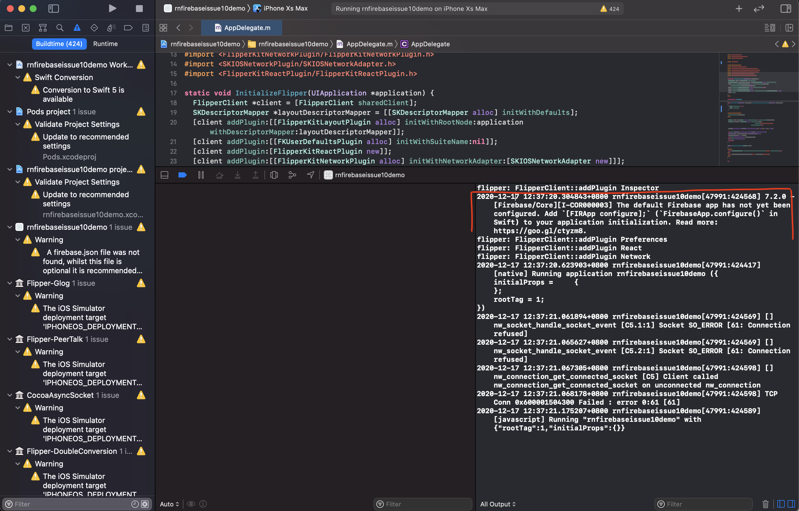

# Reproducible demo for react-native-firebase issue #10

https://github.com/invertase/react-native-firebase/issues/10

# Getting started

1. Clone this repo
2. Create a firebase project
3. Add an iOS app to that project
4. Download the config file `Google-Services.plist`.
5. Replace the `Google-Services.plist` on `ios/` with the one you downloaded.
6. cd on the cloned repo
7. `yarn install-all` which will do: `yarn install && cd ios && pod install && cd ..`
8. Open app in xcode.
9. Make sure to clear the console on the bottom right side.
10. Run the app.
11. Look at the console.
12. Ask why the bug happens

# How did I replicated it?

1. Initialize a new react-app
2. Follow instructions at https://rnfirebase.io/ (you can skip android since this issue only happens on iOS)

[Check out the diff](https://github.com/aprilmintacpineda/repro-rn-firebase-10/commit/e95b9c59a278725429da9d23f448d9f855cbafd9)